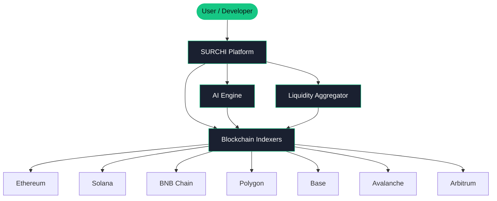

SURCHI is built on a multi-layered data pipeline that continuously ingests, normalizes, and enriches on-chain data from seven blockchains simultaneously. When you search for a token, audit a contract, or analyze a wallet, you're interacting with a system that has already pre-processed millions of blocks worth of data — and is actively listening for new events in real time. This page explains the architecture behind that system and how each component contributes to the insights you see on-screen.

## Architecture Overview

The diagram below shows how data moves through the SURCHI platform — from raw blockchain events to the analytics and signals surfaced in the UI and API.

## Core Components

Each module in the SURCHI platform is purpose-built for its role in the data pipeline. They work together in real time to deliver the analytics you rely on.

<CardGroup cols={2}>
  <Card title="Blockchain Indexer" icon="database">
    SURCHI runs dedicated indexer nodes for each supported chain. These nodes listen to every new block and extract token transfers, contract interactions, DEX trades, liquidity events, and wallet activity. Data is parsed, deduplicated, and written to SURCHI's normalized data store within seconds of on-chain confirmation. The indexer layer is horizontally scalable, ensuring consistent latency even during high-throughput events like token launches or market-wide volatility spikes.
  </Card>
  <Card title="AI Audit Engine" icon="robot">
    The AI Audit Engine analyzes smart contract bytecode and source code using a suite of models trained on thousands of audited and exploited contracts. It detects common vulnerability classes — including reentrancy, integer overflow, unchecked external calls, and ownership backdoors — as well as behavioral patterns associated with rug pulls and honeypots. Each audit produces a structured risk report with a composite score, categorized findings, and plain-language explanations you can act on immediately.
  </Card>
  <Card title="Wallet Intelligence Engine" icon="magnifying-glass">
    The Wallet Intelligence Engine aggregates all on-chain activity for a given address across supported chains and assembles it into a structured profile. It calculates realized and unrealized PnL, token portfolio value over time, trade frequency and sizing patterns, wallet age, and interaction history with known protocols and contracts. Behavioral clustering models also flag wallets that exhibit patterns consistent with bots, insiders, or wash traders.
  </Card>
  <Card title="Liquidity Router" icon="arrows-split-up-and-left">
    The Liquidity Router continuously monitors liquidity pools and order books across major DEXs on each supported chain — including Uniswap, Curve, PancakeSwap, Raydium, Trader Joe, and more. When you request a swap route, the router evaluates all viable paths in real time, accounting for pool depth, price impact, swap fees, and current gas costs, then returns the optimal execution path. Routing calculations are refreshed every few seconds to reflect current market conditions.
  </Card>
</CardGroup>

## Data Flow

Understanding how a single request travels through SURCHI helps illustrate the platform's speed and depth. Here's the full lifecycle — from raw chain data to the insight delivered to you.

<Steps>
  <Step title="Ingest Chain Data">
    SURCHI's indexer nodes subscribe to each blockchain's RPC and WebSocket endpoints. Every new block triggers a batch ingestion job that extracts all relevant events — token transfers, contract calls, liquidity changes, and new contract deployments. Data is ingested across all seven chains in parallel, with no single chain acting as a bottleneck.
  </Step>
  <Step title="Index & Normalize">
    Raw blockchain data varies significantly in structure between chains (EVM vs. Solana vs. others). SURCHI's normalization layer translates all incoming data into a unified schema — standardizing address formats, token decimals, timestamp precision, and event types. This normalized data is indexed and made immediately queryable by the API and frontend.
  </Step>
  <Step title="Apply AI Analysis">
    Once data is indexed, SURCHI's AI Engine runs enrichment jobs. New contract deployments are automatically queued for audit scoring. Wallet activity updates trigger re-calculation of PnL and behavioral metrics. Liquidity events update the routing graph used by the Liquidity Router. AI enrichment happens asynchronously so it never blocks real-time data access — scores and flags appear as soon as they're computed, typically within seconds.
  </Step>
  <Step title="Serve Insights">
    Enriched data is served to the SURCHI frontend and API consumers via a combination of REST endpoints and persistent WebSocket connections. REST endpoints handle point-in-time queries (token profiles, audit reports, wallet snapshots). WebSocket channels push live updates — price changes, new transactions, alert triggers — directly to connected clients without polling. This dual-channel approach ensures both on-demand accuracy and real-time responsiveness.
  </Step>
</Steps>

## Real-Time Updates

SURCHI uses persistent WebSocket connections to push live on-chain data directly to your browser or application as events are confirmed. There is no need to refresh the page or poll an endpoint repeatedly.

When you're viewing a token page, you receive live price ticks, new transaction notifications, and liquidity depth updates as they happen. When you're monitoring a wallet, new trades and transfers appear in your feed within seconds of being included in a block. When an alert condition is met — for example, a token price crossing a threshold you've set — SURCHI fires the notification immediately via WebSocket, email, or webhook, depending on your configuration.

<Info>
  WebSocket connections are available for all users browsing the SURCHI platform. Developers building on the SURCHI API can also subscribe to real-time data streams programmatically using the WebSocket API. See the [Developer API documentation](/developer/api/overview) for connection details, supported event types, and subscription filters.
</Info>
