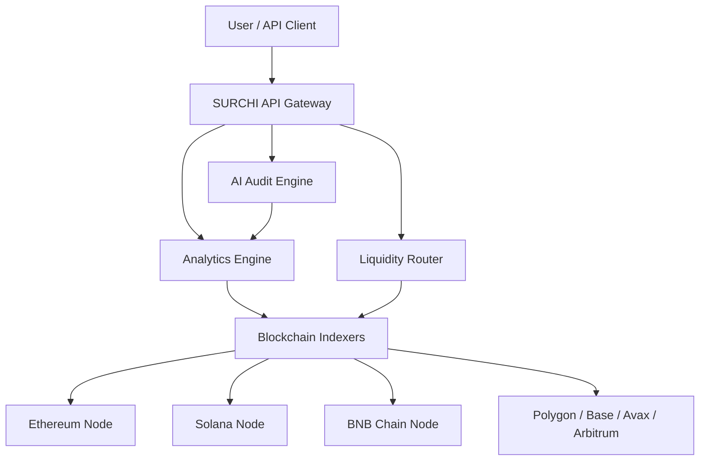

SURCHI is built on a multi-layer architecture purpose-designed for the demands of real-time, multi-chain blockchain analytics. From the moment a block is produced on any supported chain, data flows through a sequence of indexing, normalisation, AI processing, and delivery steps — all transparently, so that by the time you query a wallet, token, or transaction, you are looking at up-to-the-second information presented in a consistent format regardless of which underlying blockchain it originated from.

## High-Level Architecture

The diagram below shows how your requests flow through the SURCHI platform, from the API gateway down to the individual blockchain nodes that feed the system.

Every component in this pipeline is operated by SURCHI. You interact exclusively with the API Gateway — the layers beneath it are managed infrastructure that you never need to configure or maintain.

## Core Components

<CardGroup cols={2}>
  <Card title="API Gateway" icon="door-open">
    The single entry point for all requests to the SURCHI platform. Handles authentication, rate limiting, request routing, and response caching. Designed for high availability with automatic failover so your queries are always answered.
  </Card>
  <Card title="Blockchain Indexers" icon="database">
    Dedicated indexing services that connect directly to full nodes on each supported chain. They ingest every block and transaction in real time, parse on-chain events, and feed normalised data downstream for storage and analysis.
  </Card>
  <Card title="AI Engine" icon="robot">
    The machine-learning layer responsible for contract risk scoring, anomaly detection, and natural-language audit summaries. It operates on normalised data from the Analytics Engine and returns structured risk assessments accessible via the API.
  </Card>
  <Card title="Liquidity Router" icon="arrow-right-arrow-left">
    Aggregates liquidity data from DEXs across all supported chains. Powers best-price routing, pool depth analytics, and impermanent loss calculations. Feeds live trade and liquidity events directly from on-chain state.
  </Card>
  <Card title="WebSocket Server" icon="wifi">
    Maintains persistent connections with subscribed clients and pushes real-time updates for price movements, new transactions, whale alerts, and custom notification triggers — without requiring repeated polling.
  </Card>
  <Card title="Data Layer" icon="layer-group">
    A normalised, multi-chain data store that abstracts away the differences between chain-specific data formats. Regardless of whether a query touches Ethereum, Solana, or BNB Chain data, the response schema is consistent and predictable.
  </Card>
</CardGroup>

## Real-Time Data Pipeline

SURCHI operates dedicated RPC nodes for every supported blockchain. These are not shared or rate-limited public endpoints — they are infrastructure controlled by SURCHI to guarantee the throughput and reliability required for production analytics. WebSocket subscriptions to each node provide event-driven notifications for new blocks, mempool activity, and on-chain program events.

**Latency targets:**
- **Solana** — sub-second data availability (typically 400–600 ms after block confirmation)
- **EVM chains** (Ethereum, BNB Chain, Polygon, Base, Avalanche, Arbitrum) — approximately 1–2 seconds after block confirmation

Here is how data moves from the blockchain to your screen:

<Steps>
  <Step title="Block Produced">
    A new block is confirmed on the source blockchain. The SURCHI indexer for that chain receives the block event via its dedicated WebSocket subscription to a full node.
  </Step>
  <Step title="Indexer Detects & Parses">
    The blockchain indexer decodes every transaction and log in the block, extracts token transfers, DEX swaps, contract interactions, and wallet balance changes, and structures them as internal events.
  </Step>
  <Step title="Data Normalised">
    Raw chain-specific data is translated into SURCHI's unified schema. A Solana SPL transfer and an ERC-20 transfer, for example, are both represented identically in the data layer — making cross-chain queries seamless.
  </Step>
  <Step title="AI Processed">
    High-value events — such as large transfers, new token deployments, or unusual contract interactions — are routed through the AI Audit Engine for automatic risk scoring and anomaly flagging.
  </Step>
  <Step title="Pushed to Users">
    Processed data is written to the Data Layer, cache is updated, and any subscribers with matching WebSocket filters receive a real-time push notification. REST API queries against this data return immediately from cache.
  </Step>
</Steps>

## WebSockets & Real-Time Updates

For latency-sensitive use cases — live price feeds, whale monitoring, mempool alerts — SURCHI provides a WebSocket API alongside the standard REST endpoints. Once your client establishes a persistent WebSocket connection and subscribes to one or more data streams, SURCHI pushes updates to you the moment new data is processed, without any polling overhead.

**Available real-time streams include:**
- Live token price and volume updates
- New on-chain trade events for any tracked pair
- Wallet activity alerts (configurable by address and threshold)
- Whale movement notifications
- New token listing detection
- Custom alert triggers defined in your dashboard

WebSocket connections are authenticated with the same API key used for REST requests. See the [Webhooks](/developer/webhooks/overview) reference for real-time event subscription details.

## Reliability & Uptime

SURCHI's infrastructure is built with redundancy at every layer. Each supported blockchain is served by multiple independent node connections, and automatic failover ensures that a single node going offline does not interrupt data ingestion or query availability.

Key reliability properties:
- **99.9% uptime SLA** for API users on Standard tier and above
- **Redundant indexers** — at least two independent indexers per chain, with automatic consensus checking to catch data discrepancies
- **Automatic failover** at the gateway layer — requests are re-routed within milliseconds if a backend service becomes unavailable
- **Incident status** published in real time at the SURCHI status page

## Performance

SURCHI uses a tiered caching strategy to ensure that the most commonly requested data is returned with the lowest possible latency:

- **Edge cache** — token price, market cap, and holder count data is cached at the CDN edge. These values are refreshed at sub-second intervals and returned to you from the nearest geographic edge node, regardless of where your request originates.
- **Application cache** — complex aggregations such as wallet portfolio snapshots, historical OHLCV data, and AI audit results are cached at the application layer for a short TTL after the first computation, so repeated queries for the same data return instantly.
- **Direct query path** — real-time mempool data and live WebSocket streams bypass the cache entirely and are served directly from the indexer pipeline.

For common lookups — token metadata, current price, top holders, recent transactions — you should expect response times consistently under 100 ms on all paid tiers.
