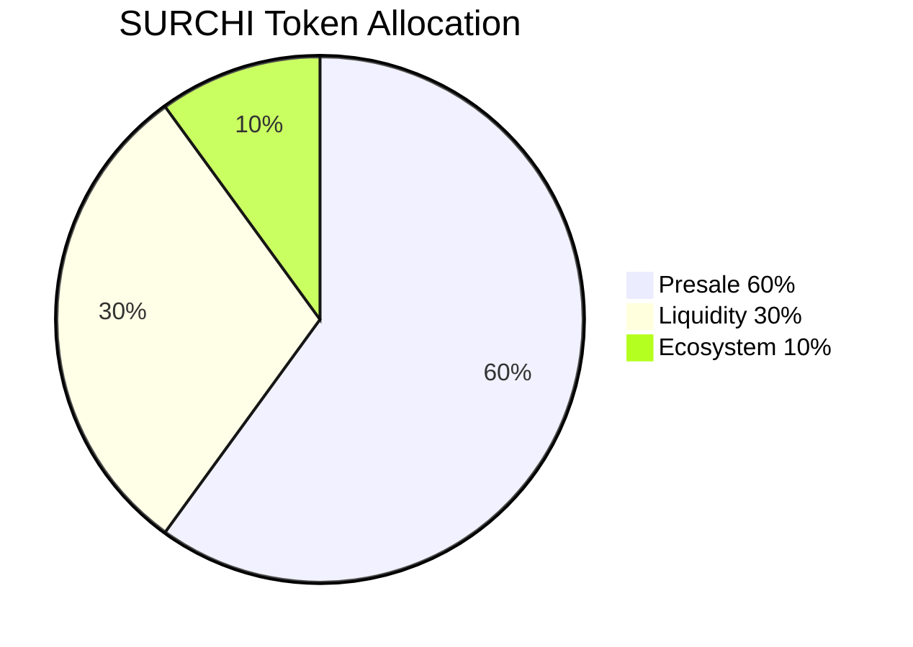

SURCHI was designed from the ground up with a community-first, fair-launch philosophy. There is no team reserve, no venture-capital allocation, and no continuous vesting schedule draining the circulating supply over time. Every token has a clearly defined purpose — community fundraising, permanent on-chain liquidity, or ecosystem growth — and the total supply is fixed at launch with the mint authority permanently revoked. What you see below is the complete picture, and it will never change.

## Total Supply

<Note>
  The total supply of $SURCHI is **19,897,905 tokens**. This is the absolute maximum that will ever exist. The mint authority was revoked at launch, making additional issuance technically impossible for any party, including the SURCHI team.
</Note>

## Allocation Breakdown

| Allocation | Percentage | Tokens | Purpose |
|---|---|---|---|
| Presale | 60% | 11,938,743 | Early supporters and community fundraising |
| Liquidity | 30% | 5,969,372 | DEX liquidity pools (Raydium, Orca) |
| Ecosystem | 10% | 1,989,791 | Platform development, rewards, partnerships |
| **Total** | **100%** | **19,897,905** | |

## Allocation Details

<AccordionGroup>
  <Accordion title="Presale — 60% (11,938,743 tokens)">
    The presale allocation represents the largest share of the $SURCHI supply and was distributed to the earliest supporters of the SURCHI platform. Presale participants funded the initial development, infrastructure buildout, and launch operations of the analytics platform.

    **Key details:**
    - Tokens were sold during a community presale event open to the public — there were no private rounds or whitelist-only allocations that excluded the broader community.
    - Presale tokens were distributed directly to participant wallets at the time of the token launch, with no lockup or cliff period imposed on buyers.
    - Participants who joined the presale received $SURCHI at a fixed presale price, giving early adopters a meaningful economic stake in the platform's growth.

    The decision to allocate 60% to the presale reflects the team's commitment to distributing the majority of supply into community hands from day one, rather than retaining tokens centrally.
  </Accordion>

  <Accordion title="Liquidity — 30% (5,969,372 tokens)">
    The liquidity allocation ensures that $SURCHI has deep, reliable on-chain liquidity across Solana's leading decentralised exchanges. Thirty percent of the total supply was paired with SOL and seeded into liquidity pools at launch.

    **Key details:**
    - Liquidity was seeded on **Raydium** and **Orca** at launch, giving traders access to $SURCHI through the two largest Solana DEXs.
    - LP (liquidity provider) tokens generated from the initial liquidity deposit have been locked or burned, meaning the underlying liquidity cannot be withdrawn by the team. This eliminates the risk of a rug pull through LP removal.
    - Permanent on-chain liquidity means you can swap $SURCHI at any time without relying on a centralised order book or the team's ongoing participation.

    This allocation protects holders by ensuring there is always a market for $SURCHI, regardless of the team's future actions.
  </Accordion>

  <Accordion title="Ecosystem — 10% (1,989,791 tokens)">
    The ecosystem allocation is the community treasury for the long-term growth of the SURCHI platform. These tokens are held in a dedicated wallet and spent according to transparent, community-approved budgets.

    **Planned uses include:**
    - **Developer grants** — funding integrations, open-source tooling, and third-party applications built on the SURCHI API
    - **Community rewards** — bug bounties, analytics competitions, ambassador programmes, and referral incentives
    - **Marketing and partnerships** — co-marketing campaigns, exchange listing fees, and strategic partnerships with other protocols
    - **Future integrations** — costs associated with adding new blockchain support, oracle integrations, or cross-chain bridge deployments

    Ecosystem fund expenditures above defined thresholds are subject to governance approval by $SURCHI holders, ensuring the community retains oversight over how these tokens are deployed.
  </Accordion>
</AccordionGroup>

## Supply Mechanics

$SURCHI is structured to be inherently deflationary in nature:

- **Mint authority revoked.** No new $SURCHI can ever be created. The on-chain record confirming revocation is publicly verifiable on Solana explorers.
- **No team allocation.** The SURCHI team holds no dedicated token reserve with a vesting schedule. There is no continuous stream of team tokens entering the market over months or years.
- **Locked liquidity.** The 30% liquidity allocation is locked, not circulating. This portion is committed to DEX pools and cannot be redirected.
- **Ecosystem spending is bounded.** The 10% ecosystem allocation is the only discretionary supply, and its use is governed by the community.

Together, these mechanics mean the effective circulating supply can only decrease or stay the same over time — it can never increase.

## Token Allocation Chart

---

<Warning>
  The information on this page is provided for educational purposes only and does not constitute financial or investment advice. $SURCHI is a utility token. Its price is subject to significant volatility and you may lose some or all of the value of any tokens you purchase. Always conduct your own research before making any financial decisions.
</Warning>
